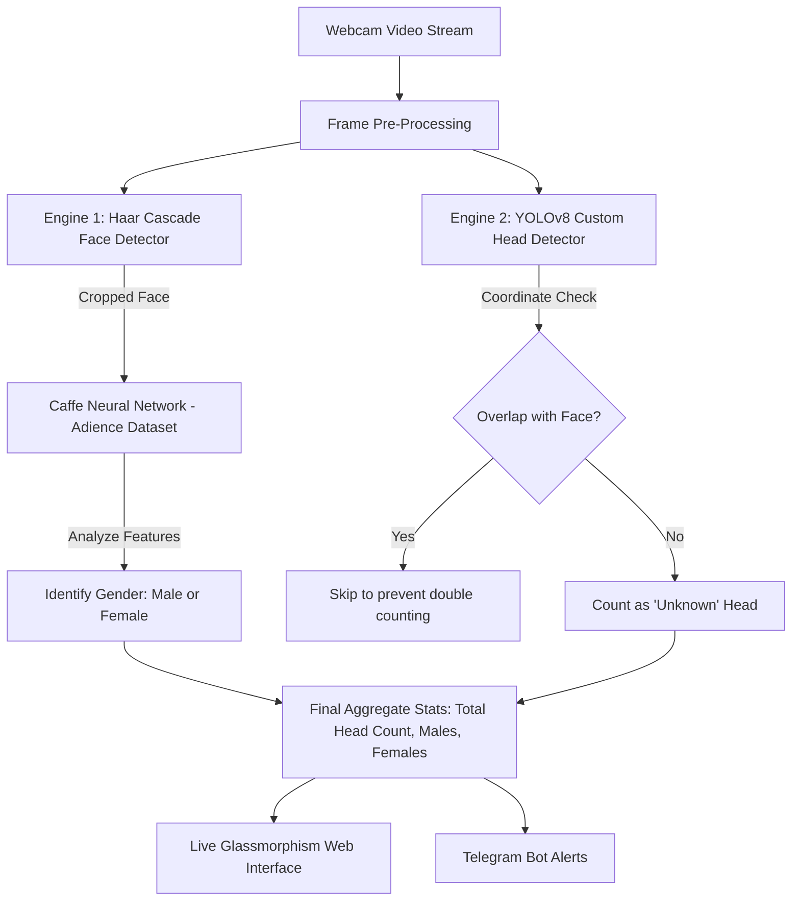

# VISIONCORE AI — SMART HEAD COUNT & ATTENDANCE SYSTEM
**A Modern Computer Vision Project for Class Submission**  
**Submitted by:** Aariz Ahmed  
**Course/Subject:** Computer Science & Artificial Intelligence  

---

## 1. PROJECT OVERVIEW

The **VisionCore AI Head Count System** is a modern, offline-first computer vision application designed to automate classroom and hall attendance. Instead of teachers manually calling out names or counting heads, this system uses a standard computer webcam, detects every person in real-time, determines their gender, and automatically broadcasts a beautiful attendance report directly to a **Telegram Bot**.

### Key Highlights of My Project:
*   **Real-Time Processing:** Delivers a buttery smooth **30 Frames Per Second (FPS)** feed by combining dual-frame buffering and smart frame-skipping techniques.
*   **Dual-Detection Engine:** Combines **Haar Cascades** (for lightning-fast front-facing detection) and **YOLOv8** (for deep learning head detection when people look away).
*   **Interactive Web Dashboard:** Built with a premium, futuristic **"Glassmorphism" UI** (frosted-glass panels, glowing neon elements, and real-time statistics).
*   **Zero-Lag Telegram Integration:** Uses Python **multi-threading** to upload attendance photos and short 5-second video logs in the background without causing the live camera feed to freeze or stutter.

---

## 2. THE DUAL-DATASET ARCHITECTURE

To make this project highly accurate under different conditions, I integrated **two separate datasets**, each doing a specialized job:

### A. The Custom Head Detection Dataset (YOLOv8)
*   **What it is:** A specialized dataset containing labeled boundaries of human heads from various angles (front, back, left, right, and top).
*   **My Dataset Link & Hosting:** [Roboflow Universe - Face & Head Count](https://universe.roboflow.com/aarizs-workspace-czs8c/face-and-head-count/dataset/1)
*   **Roboflow Workspace:** `aarizs-workspace-czs8c`
*   **How I used it:** Standard AI models are trained to detect whole bodies or just front faces. If a student is writing in their notebook, looking down, or facing the blackboard, standard systems fail. By training the state-of-the-art **YOLOv8n (You Only Look Once)** model on my custom Roboflow dataset (`data.yaml`), the camera can locate the exact position of a human head even if only the back or top of the hair is visible!
*   **Training Script:** Written in `train_model.py`, utilizing early stopping (`patience=20`) to prevent over-fitting.

### B. The Gender Recognition Dataset (Adience Benchmark)
*   **What it is:** The **Adience Benchmark Dataset** (created by Gil Levi and Tal Hassner) contains thousands of labeled facial images of men and women of different ages, captured under real-world, unconstrained conditions.
*   **How I used it:** When the camera detects a face, the program crops that exact face and passes it to a specialized Caffe Deep Learning Model (`deploy_gender.prototxt` and `gender_net.caffemodel`) pre-trained on the Adience dataset. The neural network analyzes facial details (like eyebrows, nose structures, and cheeks) to classify the person as either **MALE** or **FEMALE** with high confidence.

---

## 3. HOW THE DETECTION ENGINES WORK TOGETHER

Rather than relying on just one algorithm, I engineered a **hybrid approach** to get the best speed and accuracy:

1.  **Face Detection & Gender Extraction:** The ultra-fast **Haar Cascade** library immediately detects the front of the face, crops it, and passes it to the Adience model, marking them as either Male (Neon Blue box) or Female (Neon Pink box).
2.  **Head Detection Fallback:** At the same time, the custom **YOLOv8** model scans the image for heads.
3.  **Overlap Prevention (IOU):** The code compares coordinates. If YOLOv8 finds a head that matches where Haar Cascade already found a face, it skips it to prevent double counting. If YOLOv8 finds a head without a face (e.g., someone looking away), it counts them as an "Unknown Head" in a clean white box.

---

## 4. HOW TELEGRAM IS CONNECTED (STEP-BY-STEP)

Connecting a physical camera on my desk to a mobile chat application was one of the most exciting parts of this project! Here is exactly how I built that bridge:

### Step 1: Creating the Bot in Telegram
I opened Telegram and searched for the official `@BotFather`. Sending the command `/newbot` prompted me to name my bot. `@BotFather` then generated a unique **HTTP API Bot Token** (a long string of numbers and letters, like `123456789:ABCdefGh...`). This Token acts as the username and password for our Python program to command the bot.

### Step 2: Grabbing the Chat ID
A Bot cannot message users out of nowhere for security reasons. I initiated a chat with my bot and sent a test message. In the background, my Python backend (`app.py`) ran a request to:
`https://api.telegram.org/bot<YOUR_TOKEN>/getUpdates`
This allowed the server to read the incoming messages, extract my personal account's unique numeric **Chat ID** (e.g., `987654321`), and store both details in a local configuration file named `telegram_config.json`.

### Step 3: Pushing Reports with Python APIs
When a trigger is fired, Python uses the popular `requests` library to make HTTP secure posts straight to Telegram’s servers:
*   **Attendance Photo (`/sendPhoto`):** Python captures the current camera frame, removes the green hand-skeleton guides (keeping the image clean and professional), writes a temporary JPEG, and sends it with a structured caption (Total Strength, Males, Females, Time, and Day).
*   **Video Recording (`/sendVideo`):** Python packages the stored video frames from the circular queue buffer into an `.mp4` file and posts it, creating a short video clip of who walked past.

> [!TIP]
> **What is Multi-Threading and Why is it Essential Here?**
> Sending a high-resolution photo and video file over the internet takes 1.5 to 3 seconds depending on the connection. If Python did this on the main camera thread, the webcam stream on our dashboard would freeze and drop to 0 FPS every time it tried to upload. 
> To solve this, I wrote asynchronous background workers. Python creates a **new thread (Background Worker)** to compile, write, upload the files, and delete the temporary media, while the main thread continues capturing the camera smoothly at 30 FPS.

---

## 5. SMART ACTION TRIGGERS

To prevent spamming the teacher's Telegram inbox, I implemented two highly intelligent trigger modes:

| Trigger Mode | How It Works | Behind the Scenes Technology |
| :--- | :--- | :--- |
| **1. Manual Gesture (Open Palm)** | The user simply raises their hand and opens their palm toward the camera for **0.5 seconds**. The system instantly captures the attendance sheet and a 5-second video buffer and logs it to Telegram. | **MediaPipe Hands** detects 21 key points on the hand. It computes the distance from the wrist to the middle fingertip. If the tip is significantly further than the knuckle (knuckle distance x 1.1), it flags an "Open Palm". |
| **2. Automatic Stability Sensor** | If the total number of heads in the room remains **completely stable** for more than **1.5 seconds** (45 consecutive frames) and is greater than 0, the system automatically concludes that everyone is in place and sends a full report. | A frame-comparison queue (`deque`) tracks headcount changes. A counter increments when `current_count == last_count` and triggers the report once it crosses 45, setting a 45-second cool-down period to avoid duplicate reports. |

---

## 6. CODEBASE UNDER THE HOOD

This project is divided into highly organized, modular files:

*   **[app.py](app.py):** The master backend controller built on **FastAPI**. It handles the web camera streaming routes, hosts the modern Glassmorphism dashboard web files, holds the circular video queue (`deque` buffer), and coordinates the multi-threaded Telegram requests.
*   **[head_detector.py](head_detector.py):** The intelligence engine of the project. It handles webcam interactions, runs the Haar Cascade face detector, drives the custom YOLOv8 head detector, manages MediaPipe's hand tracking, and performs the Adience-based gender classification.
*   **[train_model.py](train_model.py):** The script used to train the YOLOv8 model on our custom dataset, specifying image resolutions (`imgsz=640`) and batch sizes (`batch=16`).
*   **[data.yaml](data.yaml):** The configuration file mapping our Roboflow dataset directories (`./train/images`, `./valid/images`, `./test/images`) and defining the single target class (`names: ['head']`).

---

## 7. SUMMARY & CONCLUSION

By combining **YOLOv8 deep learning**, **Haar Cascades**, **MediaPipe hand gesture recognition**, and **multi-threaded API calls**, I successfully developed a fully automated, offline-first attendance solution. This system eliminates manual paperwork, ensures high visual performance via a customized dashboard, and communicates seamlessly with external applications (Telegram) in real-time.

> [!NOTE]
> *This project demonstrates the powerful application of Computer Vision (CV) and Convolutional Neural Networks (CNNs) in resolving real-world logistical challenges like class attendance, queue management, and occupancy tracking.*

**Developed and Presented by:**  
**Aariz Ahmed**  
*Robocoupler VisionCore Developer*  
*May 2026*  
